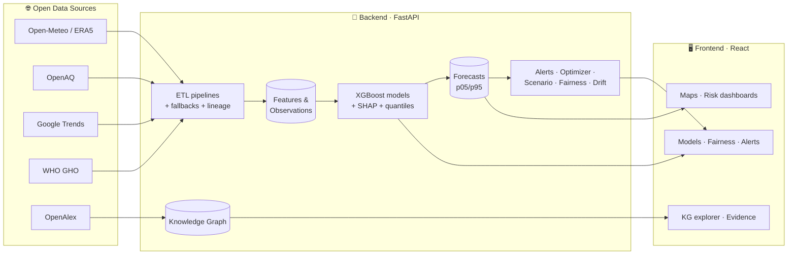
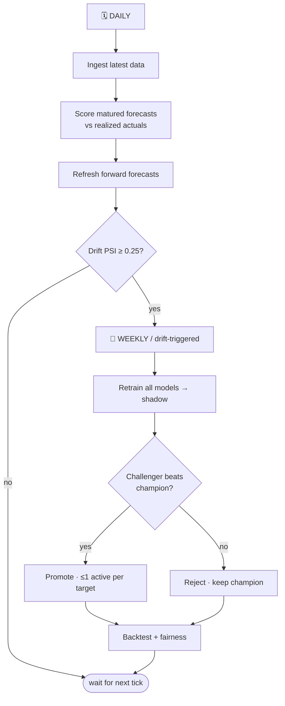

<div align="center">

# 🌍 PRITHVI-AI

### Climate-Driven Public-Health Early-Warning & Decision-Support Platform

*Turning open environmental data into explainable, actionable health-risk forecasts.*

<br/>

[](https://github.com/rupeshbharambe24/prithvi-ai-backend)
[](https://github.com/rupeshbharambe24/prithvi-ai-frontend)
[](https://www.python.org/)
[](#-license)
[]()

</div>

---

> [!NOTE]
> **PRITHVI** (पृथ्वी) is Sanskrit for *"Earth."* PRITHVI-AI forecasts how a changing climate
> threatens human health — **heatwaves, vector-borne disease, hospital surges, and air
> pollution** — and helps public-health teams act *before* a crisis, not after.

This is the **umbrella repository**. The platform is built as two independent applications,
included here as git submodules:

| Component | Repository | Stack |
|-----------|-----------|-------|
| 🧠 **Backend** | [`prithvi-ai-backend`](https://github.com/rupeshbharambe24/prithvi-ai-backend) | FastAPI · SQLAlchemy (async) · XGBoost · APScheduler |
| 🖥️ **Frontend** | [`prithvi-ai-frontend`](https://github.com/rupeshbharambe24/prithvi-ai-frontend) | React 18 · Vite · TypeScript · shadcn/ui · MapLibre |

---

## 📑 Table of Contents

- [Why it matters](#-why-it-matters)
- [What it does](#-what-it-does)
- [System architecture](#-system-architecture)
- [The continuous ML loop](#-the-continuous-ml-loop)
- [Quick start](#-quick-start)
- [Repository layout](#-repository-layout)
- [Working with submodules](#-working-with-submodules)
- [License](#-license)

---

## 🔥 Why it matters

India and the wider Global South face compounding climate-health threats — deadly **heatwaves**,
monsoon-driven **dengue** outbreaks, seasonal **PM2.5** spikes, and the **emergency-department
surges** they cause. These hit hardest where surveillance is weakest. PRITHVI-AI gives
epidemiologists, hospital operations teams, and field officers a **7–14 day operational
forecast** of four coupled risks per region — each with uncertainty bands, the scientific
evidence behind it, and an optimizer that says *where to send resources*.

The pilot covers three cities with distinct risk profiles: **Mumbai · Delhi · Chennai.**

## ✨ What it does

<table>
<tr>
<td width="50%" valign="top">

**🛰️ Real data ingestion**
- Weather (Open-Meteo / ERA5 → NASA POWER fallback)
- Air quality (OpenAQ → AQICN fallback)
- Search-trend surveillance (Google Trends)
- WHO GHO disease counts · population vulnerability

**📈 Explainable forecasting**
- XGBoost per region × target with p05/p95 bands
- SHAP top-5 drivers on every prediction
- Honest skill-vs-persistence baseline scoring

</td>
<td width="50%" valign="top">

**🧩 Decision support**
- 📚 Evidence **knowledge graph** (OpenAlex → NER → graph)
- 🎯 LP **resource optimizer** (staff allocation by risk)
- 🧪 **Scenario** planner (what-if interventions)
- 🔔 Rule-based **alerts** with multi-channel delivery

**🛡️ Trust & ops**
- ⚖️ **Fairness** — per-region error/coverage gaps
- 📉 **Drift** — PSI/KS with auto-retrain triggers
- 🔄 Continuous **train → predict → verify → retrain** loop

</td>
</tr>
</table>

## 🏗️ System architecture



## 🔄 The continuous ML loop



> [!TIP]
> **Daily inference + weekly retrain** is the design: weather forecasts change daily (so
> re-predict daily), but learned relationships change slowly (so retrain weekly), with an
> **off-cycle retrain** the moment data drift turns critical. Run any stage on demand:
> ```bash
> python -m backend.app.scripts.run_pipeline daily|weekly|score|forecast
> ```

## 🚀 Quick start

```bash
# Clone WITH submodules (important — otherwise backend/ & frontend/ are empty)
git clone --recursive https://github.com/rupeshbharambe24/prithvi-ai.git
cd prithvi-ai
```

<details>
<summary><b>▶️ Run the backend</b> (Python 3.11+)</summary>

```bash
cd backend
python -m venv .venv
.venv\Scripts\activate        # Windows  (use: source .venv/bin/activate on macOS/Linux)
pip install -e .
uvicorn backend.app.main:app --port 8000 --reload
```
Runs in **local mode** by default: SQLite, in-memory cache, seeded demo users — no Docker/Redis needed.
API docs at `http://localhost:8000/docs`.
</details>

<details>
<summary><b>▶️ Run the frontend</b> (Node 18+)</summary>

```bash
cd frontend
npm install
npm run dev
```
Open the printed URL (usually `http://localhost:5173`).
</details>

**Demo login:** `admin@example.com` / `Admin123!`

## 📂 Repository layout

```
prithvi-ai/                  ← this umbrella repo
├── backend/                 ← submodule → prithvi-ai-backend
├── frontend/                ← submodule → prithvi-ai-frontend
├── start.sh                 ← launch both for local dev
└── README.md
```

## 🔗 Working with submodules

```bash
# Already cloned without --recursive?
git submodule update --init --recursive

# Pull the latest of each component:
git submodule update --remote backend frontend

# After pushing changes to a component repo, bump its pointer here:
git add backend frontend
git commit -m "chore: bump submodule pointers"
git push
```

## 📜 License

Released under the **MIT License**.

<div align="center">
<sub>Built for resilient public health in a warming world. 🌡️🩺</sub>
</div>
